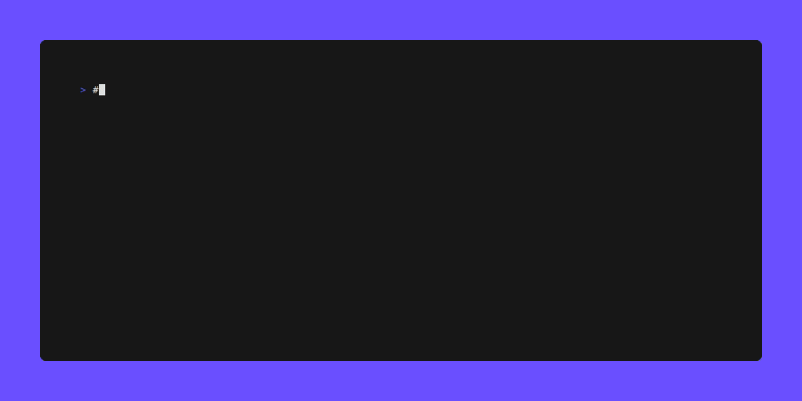

# ✅ Prérequis

- [x] Une clé d'API, chargée dans l'environnement `OPTNC_MOBITAGNC_API_KEY`

# Quick Start

## Installation

### Manuelle

Se rendre sur la page de [releases](https://github.com/opt-nc/mobitag-cli/releases) et télécharger la version correspondant à votre système d'exploitation.

### Automatique

A venir

## Comment utiliser

Une fois le binaire téléchargé et ajouté dans le PATH, vous pouvez lancer la commande `mobitag` dans votre terminal.

```sh
# Afficher l'aide
mobitag -h
```

```sh
# Tester l'environnement afin de vérifier la présence de la clé API
mobitag dryRun
```

```sh
# Envoyer un `mobit@g`
mobitag send --to xxxxxx --message "Hello World : a mobit@g from Go(lang) XD"

# En indiquant également le numéro de l'expéditeur
mobitag send --to xxxxxx --message "Hello World : a mobit@g from Go(lang) XD" --from yyyyyy
```

## Autocomplétion

Il est possible d'activer l'autocomplétion pour `mobitag` dans votre terminal.

```sh
# Pour avoir plus d'informations sur l'autocompletion :
mobitag completion <shell> --help

# <shell> peut être bash, zsh, fish, powershell.
```

Exemple pour un shell zsh :

```sh
source <(mobitag completion zsh)  # pour activer l'autocompletion dans le shell courant
mobitag completion zsh > "${fpath[1]}/_mobitag" # pour installer l'autocompletion de manière permanente
```



# ❔ A propos

Cette repo était à l'origine une **première expérimentation dont le but était de découvrir le language [`Go`](https://go.dev/)**, sur un cas concret car... c'est plus amusant et beaucoup plus motivant 🤓.

Cette expérimentation avait donc pur but de créer un cli permettant d'envoyer des mobitags depuis le terminal.


# 🔖 Ressources

- Site web officiel http://www.mobitag.nc
- [🥳 Mobitag.nc... 25 ans plus tard, des sms en SaaS via API{GEE}](https://dev.to/optnc/mobitagnc-25-ans-plus-tard-des-sms-en-saas-via-apigee-2h9e)
- [📲 Mobitag.nc for dummies](https://www.kaggle.com/code/optnouvellecaldonie/mobitag-nc-for-dummies)
- [⏱️ Mobitag Go Hackathon 2024-06-22 week-end 🤓](https://dev.to/adriens/mobitag-go-hackathon-2024-06-22-week-end-2n16)
- [⏱️ Mobitag Hackathon week-end du 2024-06-22 🤓](https://youtu.be/yVoMg7CXgaM)
